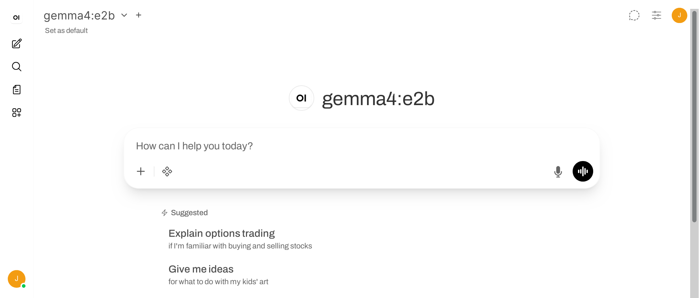

# Things I did without (almost) a GPU

### seLIA: 1st Workshop on Free Software and Open Artificial Intelligence

<style scoped>
/* Force everything to align to the top instead of the center */
section {
  display: flex;
  flex-direction: column;
  justify-content: flex-start; 
}
/* 2. Elastic whitespace that pushes the footer to the very bottom */
.spacer {
  flex-grow: 1;
}
/* Footer Layout */
.slide-footer {
  display: flex;
  justify-content: space-between;
  align-items: flex-end;
}

/* Left text block formatting */
.footer-text {
  font-size: 0.9em;
  line-height: 1.4;
  text-align: left;
}

/* Right logo formatting */
.footer-logo img {
  height: 80px; /* Adjust height to fit your logo */
  width: auto;
}
</style>

<!-- The bottom layout wrapper -->
<div class="slide-footer">
  <div class="footer-text">
    Fuenlabrada, Spain, July 6, 2026<br>
    Jesus M. Gonzalez-Barahona<br>
    <a href="https://jgbarah.github.io/presentations/">https://jgbarah.github.io/presentations/</a>
  </div>
  <div class="footer-logo">
    
  </div>
</div>


---
## Usual equipment requirements

- Depends on architecture, and size of the model
- CPU can be enough, GPU can accelerate a lot
    - Cloud options for GPUs
- RAM enough so that model fits
- Code is usually FOSS

---
# How far can we reach with easy-to-install software, and just a CPU?

---
# Text generation

---
## Ollama

```
curl -fsSL https://ollama.com/install.sh | sh
ollama serve
```

```
ollama run gemma3:1b
```

```
curl http://localhost:11434/api/generate -d '{
"model": "gemma3:1b",
"prompt":"Why is the sky blue?"
}'
```

[Using Ollama to host an LLM on CPU-only equipment to enable a local chatbot and LLM API](https://blog.gordonbuchan.com/blog/index.php/2025/01/11/using-ollama-to-host-an-llm-on-cpu-only-equipment-to-enable-a-local-chatbot-and-llm-api-server/)

---

I prefer:

```
wget https://ollama.com/download/ollama-linux-amd64.tar.zst
tar xvf ollama-linux-amd64.tar.zst
bin/ollama serve
```

```
bin/ollama run gemma3:1b
```

Si tienes suficiente RAM:

```
ollama run gemma4:e2b
ollama run gemma4:e4b
ollama run gemma4:12b
```

https://ollama.com/library/gemma4

---
## Open WebUI: how to run

```
uv venv --python 3.11
uv pip install open-webui
uv run open-webui serve
```

Now, open http://localhost:8080

---



---
## Jan: how to run

* Fetch the Debian package (or the one for your OS)

```
sudo pkg -i Jan_0.6.9_amd64.deb
Jan
```

* Settings > Model Providers > OpenAI
* API Key "ollama"
* Base URL: http://localhost:11434/v1
* Models: add a new one ("+"), "gemma3:1b"
* Select the model in the Chat

https://github.com/janhq/jan

---


---
# Speech to text

---

## Whisper

[Whisper](https://github.com/openai/whisper), MIT License

```
uv venv
uv pip install openai-whisper
uv run whisper speech.wav --language Spanish
```

```
#!/usr/bin/python3
import whisper

model = whisper.load_model('tiny')
transcription = model.transcribe('recording.wav')
print(transcription['text'])
```

---
## VocaLinux

Speech to text in any application, works with English, Spanish...

```
curl -fsSL raw.githubusercontent.com/jatinkrmalik/vocalinux/main/install.sh \
-o /tmp/vl.sh && bash /tmp/vl.sh
```

Backends:

* whisper.cpp (supports Vulkan)
* Whisper
* VOSK (for low-RAM devices)

https://github.com/jatinkrmalik/vocalinux/

---
## Adding subtitles to a video

The OfiLibre way

* Speech to text: Whisper
* Diarization (who speaks): Pyannote
* Embed subtitles: FFmpeg

https://ofilibre.gitlab.io/guias/automatizacion-contenido-audiovisual/

---
# Text to speech

---

## Kokoro-82M

```
uv venv
uv pip install kokoro
uv run kokoro -m ef_dora -i texto.txt -o texto.wav
```

https://github.com/hexgrad/kokoro

---
## Koko Clone

Some voice-cloning capabilities on top of Kokoro

```
git clone https://github.com/Ashish-Patnaik/kokoclone
cd kokoclone
uv sync
uv run cli.py --text "Texto a leer" --lang es \
  --ref orginal.wav --out output.wav
uv cli.py --mode convert --source original.wav \
  --ref target.wav --out revoiced.wav
```

https://github.com/Ashish-Patnaik/kokoclone


---
# Some other options

---
## Text generation

* llama.cpp: designed for speed and efficiency

* LocalAI: Drop-in OpenAI API replacement

* Oobabooga TextGen: specialized in text generation
* KoboldCpp: text generation based on llama.cpp

---
## Image generation

* [ComfyUI](https://www.comfy.org/), [repo](https://github.com/comfyanonymous/ComfyUI): front-end and UI for several self-hostable text-to-image and text-to-video models

* [Wan2GP](https://github.com/deepbeepmeep/Wan2GP): front-ed and UI for several self-hostable text-to-video models

---
## Agents and other applications

* [OpenCode](https://opencode.ai/): assistant, agentic
  * CLI, web and desktop app

* [Hive](https://morapelker.github.io/hive/): orchestrator for coding agents

* [AnythingLLM](https://anythingllm.com/): assistant, agentic

* [FastSDCPU](https://github.com/rupeshs/fastsdcpu): image generation optimized for CPU

* [Lemonade](https://github.com/lemonade-sdk/lemonade): LLM, image and speech generation tool
  * Works well with Vulkan, apparently recognizing my Intel Iris GPU

---
# Agents and other applications (2)

* [OpenClaw](https://openclaw.ai/): Agentic system

* [Hermes agent](https://github.com/NousResearch/hermes-agent): Agentic system

* [Autoresearch](https://github.com/karpathy/autoresearch): Self-improvign agent

* [Good night, have fun](https://github.com/kunchenguid/gnhf): Autoresearch-style agent, for coding

---

# If speed is not a (big) problem, you can reach really far

---


<style scoped>
section {
  text-align: right;
  font-size: 1.5em;
}
</style>

Copyright 2026 Jesús M. Gonzalez-Barahona

Some rights reserved.

This presentation is distributed under a
Creative Commons Attribution-ShareAlike 4.0 International license,
available from

http://creativecommons.org/licenses/by-sa/4.0/es/deed.es

