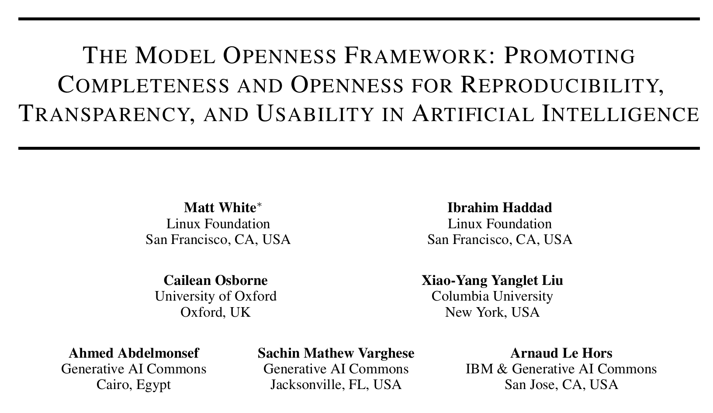

# Generative AI in your own infrastructure

### seLIA: 1st Workshop on Free Software and Open Artificial Intelligence

<!-- The bottom layout wrapper -->

  

    Fuenlabrada, Spain, July 6, 2026 
    Jesus M. Gonzalez-Barahona 
    <a href="https://jgbarah.github.io/presentations/">https://jgbarah.github.io/presentations/</a>
  

  

    
  

---
## What's in a generative model

- Architecture
  - Weights, just weights
  - Software to make inferences
  
  But also:

  - Data to train, benchmark
  - Software to train, benchmark
  - Weights of intermediate models
  - Documentation, explaining everything

---
## A wide spectrum

* Behind-app model
* Directly accessible model
* Available weights model
* Open weight model
* Open source model
* Reproducible (libre) model

---

---
## Classes of "openess"

    
https://arxiv.org/abs/2403.13784

---

## Classes of "openess"

- Open model: architecture, model parameters, weights & metadata, tech report, model card, data card

- Open tooling: open model plus training, inference, and evaluation code, libraries, evaluation data

- Open science: open tooling plus paper, datasets, log files, intermediate models parameters, weights & metadata

---
## For each of them...

- Freedom of use
- Freedom of study
- Freedom of modification
- Freedom of sharing

The "four freedoms" from ["What is Free Software?"](https://www.gnu.org/philosophy/free-sw.html)

---

## Some specific aspects

* Access: can you run inferences the way you want?

* Control on the model: can you modify the way the model works? (eg, finetune it)

* Control on your data: can you control the prompt, the results?

* Autonomy: how much you depend on the model provider?

* Trust: can you ensure the model works as intended? (eg, backdoors, etc.)

---
## Why this matters?

* Model access: Use cases, innovation, integration

* Model control: Use cases, innovation, integration

* Data control: Privacy, ndependence, reliance

* Autonomy: Market competition, independence, reliance

* Trust: Security, transparency.

---
# Behind-app model

---

## Behind-app model

* An application uses one or more models to provide some service

* It can be a local or cloud application

* The application may be generalist or very specific

* The model may change over time

---

## Behind-app model

* Access: use the model only in the intended way

* Model control: none

* Data control: none

* Autonomy: none

* Trust: none

---
# Directly accessible model

---
## Directly accessible model

* Access usually via HTTP API

* The API defines to which extent the model can be controlled

* Libraries and SDKs may be available

* Designed for building apps, depending on the API

* The model may change over time

---

## Directly accessible model

* Access: use as you want, but API restricts parameters

* Model control: limited, depending on the API

* Data control: none

* Autonomy: none

* Trust: none

---
# Available weights model

---

## Available weights model

* Weights are available

* Usually, software for inferences is available / FOSS

* Can be run on trusted infrastructure

* Finetuning, etc. is usually possible

* Redistribution, modification, use may be conditioned or forbidden

In some cases, referred as "open weight models"

---

## Available weights model

* Access: use as you want if conditions are met

* Model control: deep control, if conditions are met

* Data control: complete

* Autonomy: depends on the conditions

* Trust: none

---
# Open weight model

---

## Open weight model

* Allows use, redistribution, derived works

* No conditions for use

* Derived works: finetuning, integration...

* Does not require information about the model, its training, etc. (no freedom of study)

[Open Weight Definition](https://openweight.org/)

[Open-Weight AI Models: What They Are, and Why OpenAI’s Next Move Matters](https://medium.com/@CodeWithYog/f86fe481973a)

---

## Open weight model

* Access: use as you want

* Model control: deep control

* Data control: complete

* Autonomy: only study is restricted

* Trust: none

---
# Open source model

---

## Open source model

* Allows use, redistribution, derived works

* No conditions for use

* Derived works: finetuning, integration...

* Open source software for training, inferencing

* Detailed description of training, doesn't require availability of the training dataset

---

## Open source model

[Open Source AI Definition](https://opensource.org/ai/open-source-ai-definition)

[What are Open Weights?](https://opensource.org/ai/open-weights)

[Proposal -- Interpretation of DFSG on Artificial Intelligence (AI) Models](https://lists.debian.org/debian-vote/2025/04/msg00101.html)

---

## Open source model

* Access: use as you want

* Model control: deep control

* Data control: complete

* Autonomy: detailed study is restricted

* Trust: partial

---
# Reproducible (libre) model

---

## Reproducible (libre) model

* Allows use, redistribution, derived works

* No conditions for use

* Derived works: finetuning, integration...

* All information about the model

* Requires availability of the training dataset

---

## Reproducible (libre) model

* Access: use as you want

* Model control: deep control

* Data control: complete

* Autonomy: complete

* Trust: complete

---
## Reproducible (libre) model examples

* [Olmo3](https://allenai.org/olmo), [technical report](https://arxiv.org/abs/2512.13961) (2025-12)
    * Apache 2.0 License

* [MAP-Neo](https://map-neo.github.io/) (2025-04)
    * Apache 2.0 License

---
## Reproducible (libre) model examples

* [LLM360 K2](https://huggingface.co/collections/LLM360/k2-6622ae6911e3eb6219690039), [technical report](https://www.llm360.ai/reports/K2_tech_report.pdf) (2024-07)
    * [Other LLM360 models](https://www.llm360.ai/index.html#models)

* [Apertus](https://www.swiss-ai.org/apertus) (2025-09)
    * Apache 2.0 License

* [Alia](https://alia.gob.es/) (2026-02)
    * Apache 2.0 License

---

---

|  | Access | Model Control | Data Control | Autonomy | Trust |
| --- | --- | --- | --- | --- | --- |
| Behind-app | App-defined | None | None | None | None |
| Directly accessible | API restrictions | API restrictions | None | None | None |
| Available weights | With conditions | With conditions | Complete | With conditions | None |
| Open weight | Use as you want | Deep control | Complete | Study restricted | None |
| Open source | Use as you want | Deep control | Complete | Detailed study restricted | Partial |
| Reproducible | Use as you want | Deep control | Complete | Complete | Complete |

---
## Open issues

* Complex relationship of data, recipes, architecture, weights, software...
    * Missing exact definitions for several of the categories
    * It is not easy to find out in which category is a model
* Adapted definitions for finetunes and other evolutions of models?
* How to ensure that declarations are true?

---

# Self-hostable models

---
## Minimum for running in your infra

- Inference code, with libraries
- Model parameters & metadata (weights)
- Technical report (prompts, etc.)
- Model card (convenient)

At least, "available weights" if inference code is available

**Self-hostable models**

---
## Self-hostable models

* If supporting software is available
    * Available weights models
    * Open weights models
* Open source models
* Reproducible models

---

---

* [HuggingFace Models](https://huggingface.co/models)

---

Copyright 2026 Jesús M. Gonzalez-Barahona

Some rights reserved.

This presentation is distributed under a
Creative Commons Attribution-ShareAlike 4.0 International license,
available from

http://creativecommons.org/licenses/by-sa/4.0/es/deed.es

