# Generative AI models running in your own infrastructure

### Escuela de Ingeniería de Fuenlabrada

Fuenlabrada, Spain, March 27, 2025

Jesus M. Gonzalez-Barahona

<small>https://jgbarah.github.io/presentations/</small>

---
## What's in a generative model

- Architecture
  - Weights, just weights
  - Software to make inferences
  
  But also:

  - Data to train, benchmark
  - Software to train, benchmark
  - Weights of intermediate models
  - Documentation, explaining everything

---
## A wide spectrum

* Behind-app model
* Directly accessible model
* Available weights model
* Open weight model
* Open source model
* Reproducible (libre) model

---

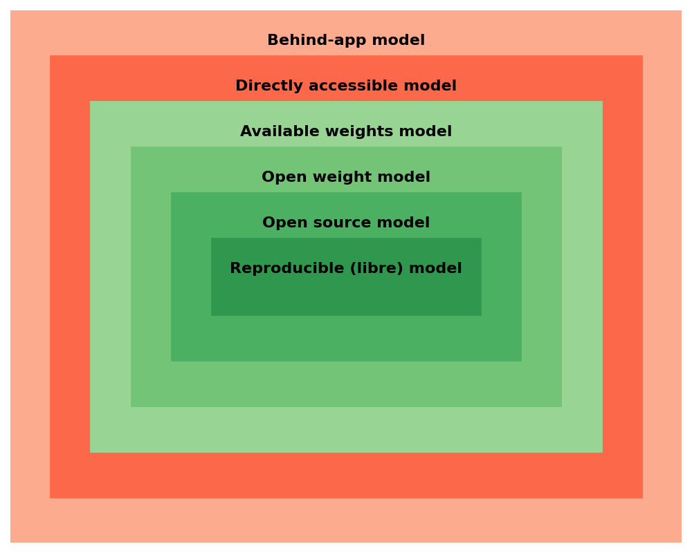

---
## Classes of "openess"


    
https://arxiv.org/abs/2403.13784

---

## Classes of "openess"

- Open model: architecture, model parameters, weights & metadata, tech report, model card, data card

- Open tooling: open model plus training, inference, and evaluation code, libraries, evaluation data

- Open science: open tooling plus paper, datasets, log files, intermediate models parameters, weights & metadata

---
## For each of them...

- Freedom of use
- Freedom of study
- Freedom of modification
- Freedom of sharing

The "four freedoms" from ["What is Free Software?"](https://www.gnu.org/philosophy/free-sw.html)

---

## Some specific aspects

* Access: can you run inferences the way you want?

* Control on the model: can you modify the way the model works? (eg, finetune it)

* Control on your data: can you control the prompt, the results?

* Autonomy: how much you depend on the model provider?

* Trust: can you ensure the model works as intended? (eg, backdoors, etc.)

---
## Why this matters?

* Model access: Use cases, innovation, integration

* Model control: Use cases, innovation, integration

* Data control: Privacy, ndependence, reliance

* Autonomy: Market competition, independence, reliance

* Trust: Security, transparency.

---

## Behind-app model

* An application uses one or more models to provide some service

* It can be a local or cloud application

* The application may be generalist or very specific

* The model may change over time

---

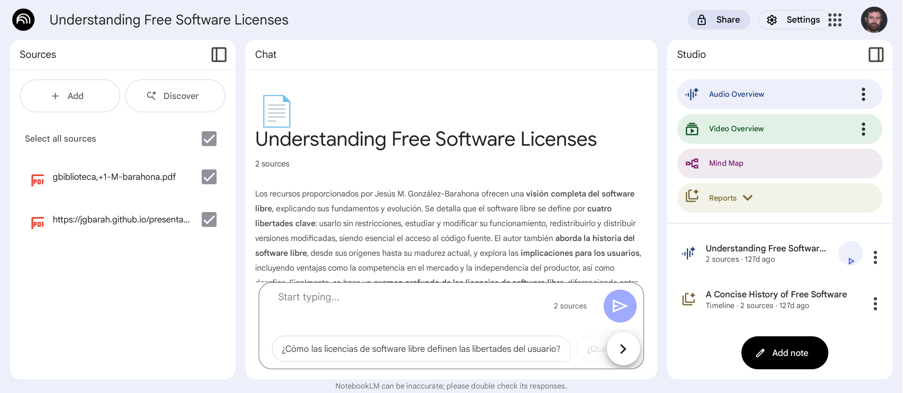

* Google NotebookLM

---

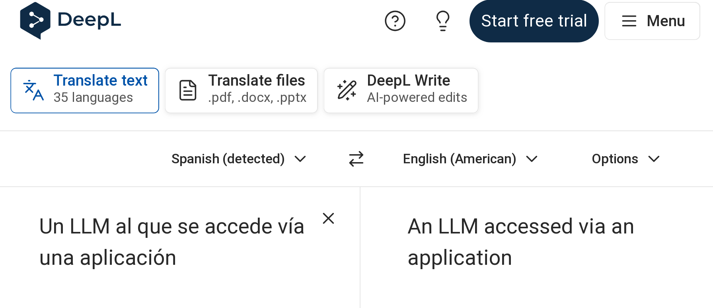

* DeepL

---

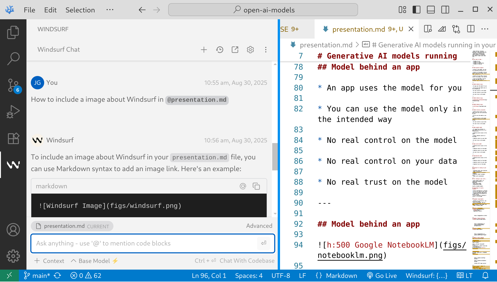

* Windsurf in Visual Studio code

---

* HuggingFace Spaces

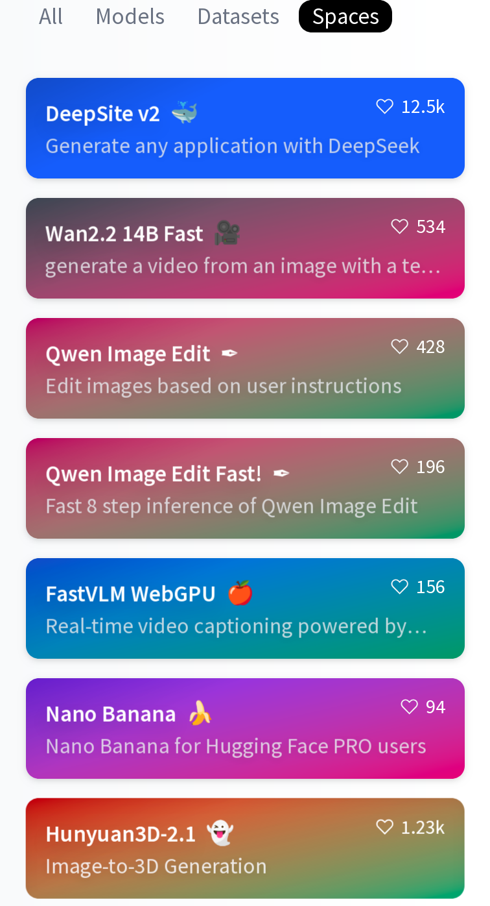 

---

## Behind-app model

* Access: use the model only in the intended way

* Model control: none

* Data control: none

* Autonomy: none

* Trust: none

---
## Directly accessible model

* Access usually via HTTP API

* The API defines to which extent the model can be controlled

* Libraries and SDKs may be available

* Designed for building apps, depending on the API

* The model may change over time

---

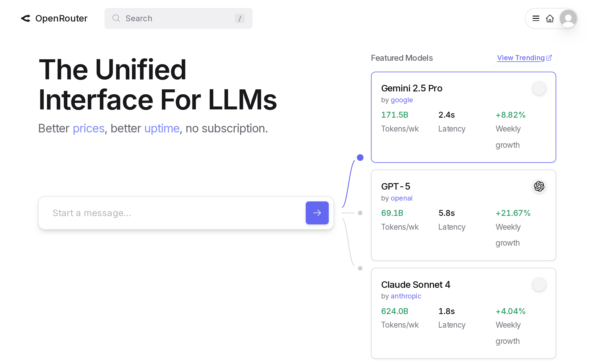

* OpenRouter

---

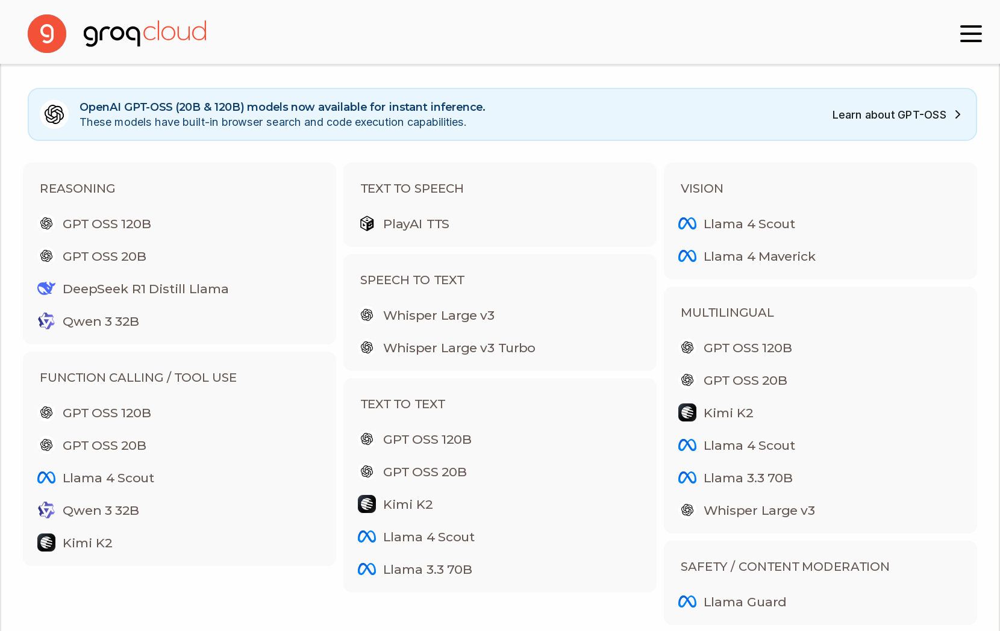

* Groq

---

## Directly accessible model

* Access: use as you want, but API restricts parameters

* Model control: limited, depending on the API

* Data control: none

* Autonomy: none

* Trust: none

---

## Available weights model

* Weights are available

* Usually, software for inferences is available / FOSS

* Can be run on trusted infrastructure

* Finetuning, etc. is usually possible

* Redistribution, modification, use may be conditioned or forbidden

In some cases, referred as "open weight models"

---

## Available weights model

* Access: use as you want if conditions are met

* Model control: deep control, if conditions are met

* Data control: complete

* Autonomy: depends on the conditions

* Trust: none

---

## Available weights models examples

* [Kimi K2](https://github.com/MoonshotAI/Kimi-K2)
    * Modified MIT License

* [LLaMa3 models](https://www.llama.com/models/llama-3/) (2025-04)

    * Meta Community License
    * [Meta’s LLaMa license is still not Open Source](https://opensource.org/blog/metas-llama-license-is-still-not-open-source)

---
## Available weights models examples

* [Gema3](https://deepmind.google/models/gemma/)
    * Gemma Terms of Use

* [Mistral Small 4](https://mistral.ai/news/mistral-small-4) (2026-03)
    * Apache 2.0

---
## Available weights models examples

* [Tülu3](https://allenai.org/tulu)
    * Llama Community License
    * Finetuned from Llama3.1
    * All details and data of the finetune available

* [Cohere Command A](https://huggingface.co/spaces/CohereLabs/c4ai-command) (2025-08)
    * Creative Commons Attribution-NonCommercial 4.0 International and Cohere Terms of Use

---

## Open weight model

* Allows use, redistribution, derived works

* No conditions for use

* Derived works: finetuning, integration...

* Does not require information about the model, its training, etc. (no freedom of study)

[Open Weight Definition](https://openweight.org/)

[Open-Weight AI Models: What They Are, and Why OpenAI’s Next Move Matters](https://medium.com/@CodeWithYog/f86fe481973a)

---

## Open weight model

* Access: use as you want

* Model control: deep control

* Data control: complete

* Autonomy: only study is restricted

* Trust: none

---
## Open weight model example

* [Granite Code](https://huggingface.co/collections/ibm-granite/granite-code-models-6624c5cec322e4c148c8b330) (2024-11)
    * Apache 2.0 License
    * Very few information about the model, training, etc.

---

## Open source model

* Allows use, redistribution, derived works

* No conditions for use

* Derived works: finetuning, integration...

* Open source software for training, inferencing

* Detailed description of training, doesn't require availability of the training dataset

[Open Source AI Definition](https://opensource.org/ai/open-source-ai-definition)

[What are Open Weights?](https://opensource.org/ai/open-weights)

[Proposal -- Interpretation of DFSG on Artificial Intelligence (AI) Models](https://lists.debian.org/debian-vote/2025/04/msg00101.html)

---

## Open source model

* Access: use as you want

* Model control: deep control

* Data control: complete

* Autonomy: detailed study is restricted

* Trust: partial

---

## Open source model examples

* [DeepSeek](https://huggingface.co/deepseek-ai/DeepSeek-V3.2) (2025-09)
    * MIT License

* [GPT-OSS](https://openai.com/open-models/) (2025-08)
    * Apache 2.0 License

* [Qwen3.5](https://huggingface.co/collections/Qwen) (2026-02)
    * Apache 2.0 License

---

## Reproducible (libre) model

* Allows use, redistribution, derived works

* No conditions for use

* Derived works: finetuning, integration...

* All information about the model

* Requires availability of the training dataset

---

## Reproducible (libre) model

* Access: use as you want

* Model control: deep control

* Data control: complete

* Autonomy: complete

* Trust: complete

---
## Reproducible (libre) model examples

* [Olmo3](https://allenai.org/olmo), [technical report](https://arxiv.org/abs/2512.13961) (2025-12)
    * Apache 2.0 License

* [MAP-Neo](https://map-neo.github.io/) (2025-04)
    * Apache 2.0 License

---
## Reproducible (libre) model examples

* [LLM360 K2](https://huggingface.co/collections/LLM360/k2-6622ae6911e3eb6219690039), [technical report](https://www.llm360.ai/reports/K2_tech_report.pdf) (2024-07)
    * [Other LLM360 models](https://www.llm360.ai/index.html#models)

* [Apertus](https://www.swiss-ai.org/apertus) (2025-09)
    * Apache 2.0 License

---


---

<style scoped>section{font-size:20px;}</style>

|  | Access | Model Control | Data Control | Autonomy | Trust |
| --- | --- | --- | --- | --- | --- |
| Behind-app | App-defined | None | None | None | None |
| Directly accessible | API restrictions | API restrictions | None | None | None |
| Available weights | With conditions | With conditions | Complete | With conditions | None |
| Open weight | Use as you want | Deep control | Complete | Study restricted | None |
| Open source | Use as you want | Deep control | Complete | Detailed study restricted | Partial |
| Reproducible | Use as you want | Deep control | Complete | Complete | Complete |

---

## Reproducibility in AI research

[Reproducible AI: Why it Matters & How to Improve it](https://research.aimultiple.com/reproducible-ai/)

[Guidelines for Empirical Studies in Software Engineering involving Large Language Models](https://arxiv.org/abs/2508.15503)

---

## Ethical model

* Conditions on use: "ethical use"

* Conditions on training: "ethical datasets"

Depends on what is considered as "ethical"

---

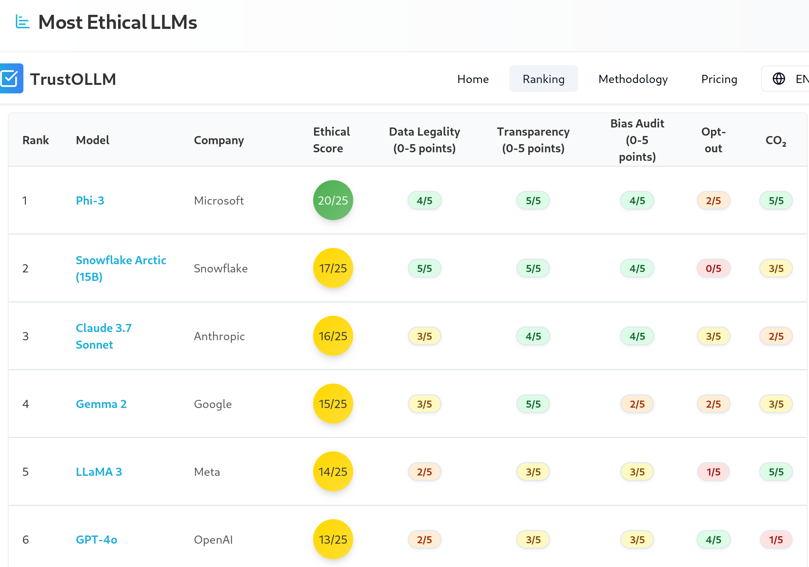

[LLM Responsible AI Rankings](https://www.trustollm.com/ranking)

---
## Open issues

* Complex relationship of data, recipes, architecture, weights, software...
    * Missing exact definitions for several of the categories
    * It is not easy to find out in which category is a model
* Adapted definitions for finetunes and other evolutions of models?
* How to ensure that declarations are true?

---

# Self-hostable models

---
## Minimum for running in your infra

- Inference code, with libraries
- Model parameters & metadata (weights)
- Technical report (prompts, etc.)
- Model card (convenient)

At least, "available weights" if inference code is available

**Self-hostable models**

---
## Self-hostable models

* If supporting software is available
    * Available weights models
    * Open weights models
* Open source models
* Reproducible models
* Ethical models (usually)

---


---

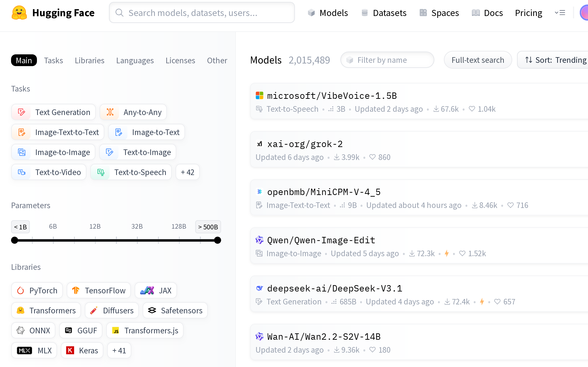

* [HuggingFace Models](https://huggingface.co/models)

---

## Advantages of self-hostable

* Future availability is ensured
* You can run them in your infra
* You can integrate them easily
* Competition in the market for access via API
* You decide if running in cloud, or in the edge

---

## Disadvantages of self-hostable

* Available models are usually not as good as the state of the art
    * (maybe 6-12 months delay?)
* Improvement and support are not always happening

---
## Advantages of self-hosting

* Full control of everything
* For many kinds of tasks, it is good enough
* Easier for reproducibility

---
## Disadvantages of self-hosting

* Investment in infrastructure
* Limitations of the hardware you can get
* Maintenance is your responsibility
* Being up-to-date maybe a pain
    * Decissions on best models
    * Decisions on best software
    * Decisions on best hardware

Technical skills required!

---
## Equipment requirements

- Depends on architecture, and size of the model
- CPU can be enough, GPU can accelerate a lot
    - Cloud options for GPUs
- RAM enough so that model fits
- Code is usually FOSS

You can also deploy in a cloud-based host

---
## Economic aspects

* Hardware requirements
    * Payback period
* Size and characteristics of the workload
* Sources of complexity:
    * Multiple users, multiple models, etc
* Maintenance costs
* Energy consumption

You have to do the math

---
## Locally runnable via API

* Many different providers, similar APIs
    * Most of them use OpenAI API
    * Many of them provide several models
    * Examples: OpenRouter, Groq
* Frameworks provide backends for several providers
    * Examples: LiteLLM, LangChain
* Easy testing of several models
* Depending on workload, can be cheaper

---
## Quantization

* Used to reduce hw requirements
* From float32 to fp16, to int8, or less
* Usually, post-training
* Several formats:
    * GPTQ, usually using `safetensors` files
    * GGUF, popular in the llama.cpp ecosystem

[HuggingFace Guide on Quantization](https://huggingface.co/docs/optimum/en/concept_guides/quantization)

[GGUF: Structure and Usage](https://apxml.com/courses/practical-llm-quantization/chapter-5-quantization-formats-tooling/gguf-format)

---
## Finetuning

* Adapting a model to a specific task with a (usually smaller) specialized dataset

* Starting point: weights of given model.

* Adjust weights to fit the specialized dataset

* Adapter: new layers of weights added to a model to finetune it

[What is fine-tuning?](https://www.ibm.com/think/topics/fine-tuning)

---
## HuggingFace: Quantizations and finetunes

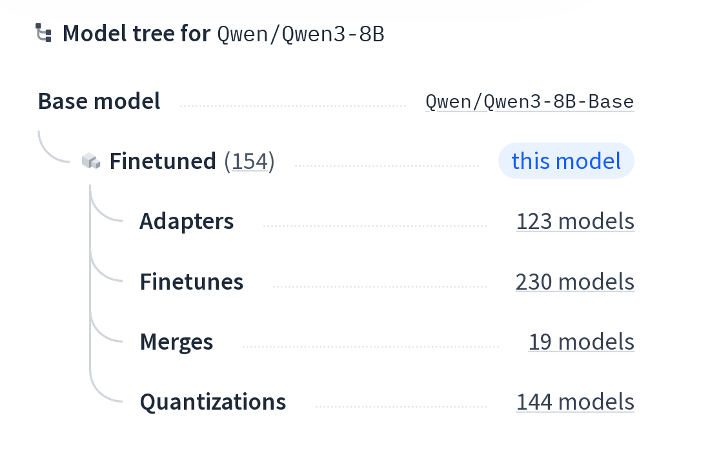

---
## Civit.AI: Images & videos

* Finetuning
* Quantizations
* Images and videos

https://civitai.com/

---
## Inference engines

* [llama.cpp](https://github.com/ggerganov/llama.cpp)
    * provides a web-based UI and HTTP API

* [vLLM](https://github.com/vllm-project/vllm)
    * provides HTTP API

---
## Frameworks for LLMs

* [LangChain](https://github.com/langchain-ai/langchain): Chain together large LLM operations into sophisticated workflows, usually to build agent tools

* [LiteLLM](https://github.com/BerriAI/litellm): Agile toolset designed for efficiency and simplicity. 

Both can use local models, of models via HTTP API

---
## Chat / assistant frontends

* [Ollama](https://ollama.com/), based on llama.cpp

* [Oobabooga WebUI](https://github.com/oobabooga/text-generation-webui)

* [Open WebUI](https://github.com/open-webui/open-webui): "almost" FOSS

* [LibreChat](https://www.librechat.ai/): [online](https://librechat-librechat.hf.space/), [source code](https://github.com/danny-avila/LibreChat)

* [Jan](https://github.com/menloresearch/jan): Local assistant

Most of them also provide an HTTP API

---
## Ollama: how to run

```
curl -fsSL https://ollama.com/install.sh | sh
ollama serve
```

```
ollama run gemma3:1b
```

```
curl http://localhost:11434/api/generate -d '{
"model": "gemma3:1b",
"prompt":"Why is the sky blue?"
}'
```

[Using Ollama to host an LLM on CPU-only equipment to enable a local chatbot and LLM API](https://blog.gordonbuchan.com/blog/index.php/2025/01/11/using-ollama-to-host-an-llm-on-cpu-only-equipment-to-enable-a-local-chatbot-and-llm-api-server/)

---
## Open WebUI: how to run

```
uv venv --python 3.11
uv pip install open-webui
uv run open-webui serve
```

Now, open http://localhost:8080

---

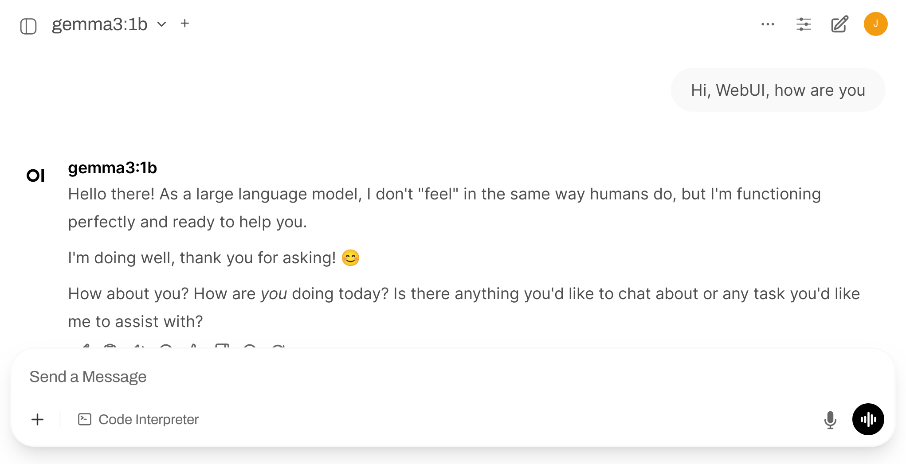

---
## Jan: how to run

* Fetch the Debian package (or the one for your OS)

```
sudo pkg -i Jan_0.6.9_amd64.deb
Jan
```

* Settings > Model Providers >OpenAI
* API Key "ollama"
* Base URL: http://localhost:11434/v1
* Models: add a new one ("+"), "gemma3:1b"
* Select the model in the Chat

---

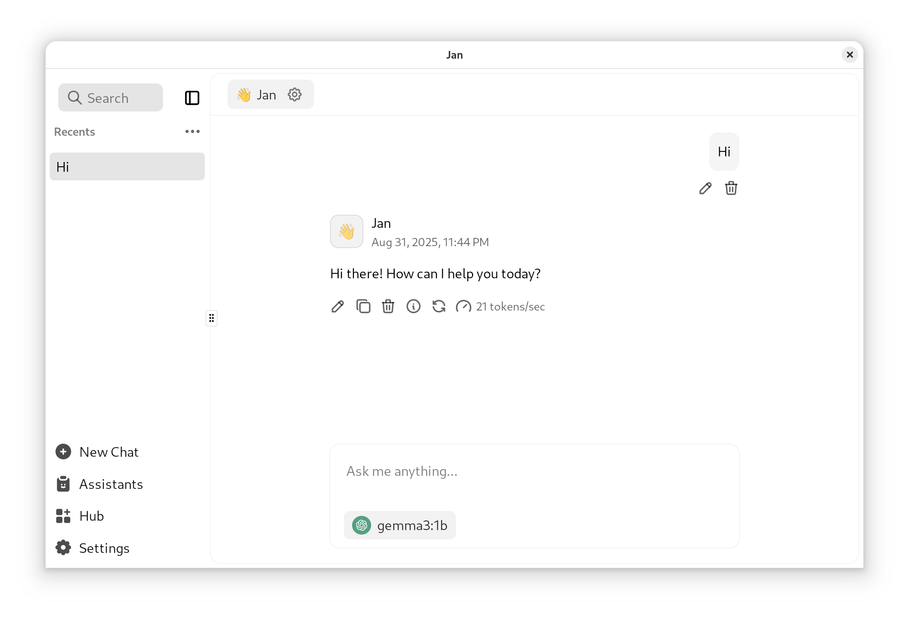

---
# Other self-hostable generative models

---
## Producing images

* [Qwen-Image](https://github.com/QwenLM/Qwen-Image), Apache 2.0 (2025-08)

* [HiDream-I1](https://github.com/HiDream-ai/HiDream-I1), MIT License (2025-07)

* [FLUX.1Kontext[dev]](https://bfl.ai/models/flux-kontext), [models](https://huggingface.co/collections/black-forest-labs/flux1-onnx-679d06b7579583bd84c8ef83), Flux Non-Commercial License (2025-08)

* [Stable Diffusion](https://stability.ai/stable-video), [models](https://huggingface.co/collections/stabilityai/stable-diffusion-35-671785cca799084f71fa2838), StabilityAI Community License (2025-01)

[A Guide to Open-Source Image Generation Models](https://www.bentoml.com/blog/a-guide-to-open-source-image-generation-models)

[Text-to-image Arena](https://lmarena.ai/leaderboard/text-to-image)

---
## Producing video

* [Wan 2.2](https://wan.video/), [repo](https://github.com/Wan-Video/Wan2.2), Apache 2.0 (2025-08)
* [Hunyuan Video](https://hunyuanvideoai.com/), [repo](https://github.com/Tencent-Hunyuan/HunyuanVideo), Tencent Hunyuan Community License
* [LTX Video](https://ltx.video/), [repo](https://github.com/Lightricks/LTX-Video), Apache 2.0
* [Stable Video Diffusion](https://stability.ai/stable-video), proprietary license, gratis for some uses

---
## Text to video and image (apps & finetunes)


* [ComfyUI](https://www.comfy.org/), [repo](https://github.com/comfyanonymous/ComfyUI): front-end and UI for several self-hostable text-to-image and text-to-video models

* [Wan2GP](https://github.com/deepbeepmeep/Wan2GP): front-ed and UI for several self-hostable text-to-video models

* [CivitAI](https://civitai.com): models and finetunes

---
# Speech to text

[Whisper](https://github.com/openai/whisper), MIT License

```
uv venv
uv pip install openai-whisper
uv run whisper speech.wav --language Spanish
```

```
#!/usr/bin/python3
import whisper

model = whisper.load_model('tiny')
transcription = model.transcribe('recording.wav')
print(transcription['text'])
```

---
## Text to speech

* [CoquiTTS](https://github.com/idiap/coqui-ai-TTS), [model](https://huggingface.co/coqui/XTTS-v2), Coqui Public Model License (2023-11)

```
$ tts --text "Texto" \
  --model_name tts_models/es/mai/tacotron2-DDC \
  --out_path speech.wav
```

* [Kokoro](https://huggingface.co/hexgrad/Kokoro-82M), Apache 2.0 (2025-01)

* [Higgs Audio V2](https://github.com/boson-ai/higgs-audio), Boson Higgs Audio 2 Community License (2025-07)

---
## Text to speech (2)

* [Chatterbox](https://huggingface.co/ResembleAI/chatterbox), MIT License (2025-04)

* [MeloTTS](https://github.com/myshell-ai/MeloTTS) & [OpenVoice v2](https://huggingface.co/myshell-ai/OpenVoiceV2) MIT License (2024-02, 2024-04)

* [FishSpeech](https://github.com/fishaudio/fish-speech), CC Attribution-NonCommercial-ShareAlike (2025-08) (2024-11)

[Exploring the World of Open-Source Text-to-Speech Models](https://www.bentoml.com/blog/exploring-the-world-of-open-source-text-to-speech-models)

---
## Other random models

* Understanding and reasoning about time series: [ChatTS](https://huggingface.co/bytedance-research/ChatTS-14B) Apache 2.0, includes training dataset (2025-08)

* 360 immersive and explorable 3D worlds: [HunyuanWorld](https://github.com/Tencent-Hunyuan/HunyuanWorld-1.0)

* Text to 3D: [LlamaMesh](https://huggingface.co/Zhengyi/LLaMA-Mesh), Llama Community License (2024-11)

* Open model and tools for building videos with AI: [OpenSora](https://hpcaitech.github.io/Open-Sora/)
  * [repo](https://github.com/hpcaitech/Open-Sora)

---
## Other applications

* [OpenCode](https://opencode.ai/): assistant, agentic
  * CLI, web and desktop app

* [AnythingLLM](https://anythingllm.com/): assistant, agentic

* [FastSDCPU](https://github.com/rupeshs/fastsdcpu): image generation optimized for CPU

* [Lemonade](https://github.com/lemonade-sdk/lemonade): LLM, image and speech generation tool
  * Works well with Vulkan, apparently recognizing my Intel Iris GPU

* [OpenClaw](https://openclaw.ai/): Agentic system

---
## Other applications

* [SurfSense](https://www.surfsense.net/): comprehensive assistant

    * [Source code](https://github.com/MODSetter/SurfSense)

* [DeerFlow](https://deerflow.tech/): comprehensive assistant

    * [Try it at VolcEngine](https://console.volcengine.com/)
    * [Source code](https://github.com/bytedance/deer-flow)

* [Hyprnote](https://github.com/fastrepl/hyprnote): note taking tool for meetings

* [TransformerLab](transformerlab): Train, Tune, Chat with LLMs

    * [Source code](https://github.com/transformerlab/transformerlab-app)

* [MobiRAG](https://github.com/nishchaljs/MobiRAG): chat with PDFs in your mobile

---
## Open training datasets

* [Chatbot Arena Leaderboard](https://lmarena.ai/) ([How it works](https://lmarena.ai/how-it-works))
    * [Datasets](https://huggingface.co/lmarena-ai)

* [LAION datasets](https://laion.ai/)

* [Common Corpus: The Largest Collection of Ethical Data for LLM Pre-Training](https://arxiv.org/abs/2506.01732)

* [The Common Pile v0.1: An 8TB Dataset of Public Domain and Openly Licensed Text](https://arxiv.org/abs/2506.05209)

* [CommonCrawl Dataset](https://commoncrawl.org/)

* [FineWeb](https://huggingface.co/datasets/HuggingFaceFW/fineweb), 18.5T tokens cleaned from CommonCrawl

---
## Benchmarks

* [Chatbot Arena Leaderboard](https://lmarena.ai/)
* [LiveBench](https://livebench.ai/)
* [LLM Leaderboard](https://artificialanalysis.ai/leaderboards/models)

* [SWE-bench](https://www.swebench.com/)
* [SWE-bench-live](https://swe-bench-live.github.io/)

---
# Bonus track
# Some interesting tools

* [HuggingChat](https://huggingface.co/chat/)
  * Chat-like interface
  * Many models, MCP servers...

* [Petals](https://petals.dev/)
  * Inference by distributed collaboration

---
# Bonus track 2:
# Are LLMs deterministic?

---
## Why this matters?

* Reproducible research: we want experiments that can be repeated by others, with the same results

* Reproducible results: in some cases, it is important to be sure that a given input produces a given output. Always.

* Reliable debugging: for debugging a problem, exact reproduction is often needed

* Deterministic software: in some cases, we need software that is deterministic. Always.

---
## Are LLMs deterministic?

* Once weights are settled... the network itself doesn't change

* Determinism depends on:

    * Inference engine
    * System software
    * Hardware

---
## Inference engine

It is "regular", deterministic software...

except when it tries to be random

---
## Inference engine: controlling randomness (API parameters)

* `seed` can be fixed (initializes the pseudo-random number generator)
* `temperature`: 0 means "greedy sampling" (most probable next token)
*  `top_k` (shortlist selector pool): 1 means the pool for selectable words is 1 (the most likely)
* `top_p` (nucleus sampling): chains of tokens to be considered. Difficult to control, interferes with `top_k`

---
## Inference engine: controlling randomness

* Other parameters (eg, frequency or presence penalty) should be equal

* Beware: the software may use random number generators in some other places

---
### Inference engine: the balance

* Randomness in inference is there for a reason: it can be useful for creativity, for getting better outputs

* Two strategies:
    * Keep randomness, but control it (controlling all seeds for randomness)
    * Remove randomness, by controlling `temperature`, `top_k`, `top_p`

Both can be combined

---
## Supporting software

* Mixtures of experts: prompt tokens routed differently depending on composition of batches from different users 

* Framework (PyTorch, TensorFlow): non-deterministic convolution algorithms (can be configured to be deterministic)

* Differences in compilers, GPU drivers...

---
## Hardware

* Floating point rounding: different rounding approaches in different hardware (happens even in int-quantified models)
* Non-deterministic hardware

---
# References

* [Achieving Consistency and Reproducibility in Large Language Models (LLMs)](https://pub.aimind.so/creating-deterministic-consistent-and-reproducible-text-in-llms-e589ba230d44)

* [The Art of Sampling: Controlling Randomness in LLMs](https://www.anup.io/p/the-art-of-sampling-controlling-randomness)

* [Controlling Randomness in LLMs: Temperature and Seed](https://dylancastillo.co/posts/seed-temperature-llms.htm)

* [Solving Reproducibility Challenges in Deep Learning and LLMs: Our Journey](https://www.ingonyama.com/post/solving-reproducibility-challenges-in-deep-learning-and-llms-our-journey)

* [Defeating Nondeterminism in LLM Inference](https://thinkingmachines.ai/blog/defeating-nondeterminism-in-llm-inference/)

---
## Beware!

* This is about reproducibility settings keeping setup:
    * Keeping setup, and the same input, produce exactly the same output.
    * Changing the hardware, GPU driver version, inference engine version, etc, may change results.

* This is not about predictable results:
    * Slightly different inputs may lead to very different results, even with reproducible settings.

---
## Summary

* Define a seed, this may be enough
* `temperature = 0`
* `top_k = 1`
* All other parameters should be equal
* Same inference software
* No mix of different inferences
* Same system software (GPU drivers, etc)
* Same hardware (CPU, GPU, etc)
